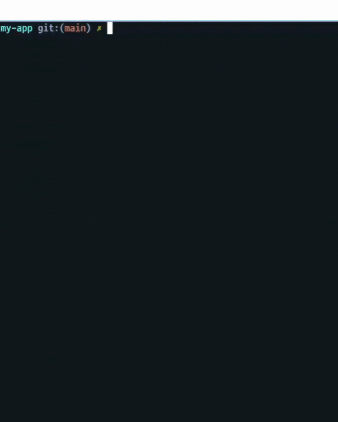

# claude-relay

<p align="center">
  
</p>

<h3 align="center">Web UI for Claude Code. Any device. Push notifications.</h3>

[](https://www.npmjs.com/package/claude-relay) [](https://www.npmjs.com/package/claude-relay) [](https://github.com/chadbyte/claude-relay) [](https://github.com/chadbyte/claude-relay/blob/main/LICENSE)

Claude Code. Anywhere.  
Same session. Same files. Same machine.  
Your files stay on your computer. Nothing leaves for the cloud.

Pick up the same Claude Code session on your phone.  
Start in the terminal, continue on your phone, switch back anytime.

Claude Code is automating more of your editing and execution workflow.
But when it needs approval or asks a question, it halts in the terminal. If you walk away, it just sits there waiting.

claude-relay eliminates this bottleneck.
It is not a thin wrapper that intercepts input/output. It drives Claude Code via the Claude Agent SDK and relays the stream from your local machine to your browser.

Get approval notifications while grabbing a coffee.
Continue working from the sofa on your iPad.
Split your browser: claude-relay on one side, your app preview on the other, and watch the code change in real time.

## Quick Start (PM2 - Recommended)

```bash
# Clone and setup
cd /home/ubuntu/hscheema1979/ultra-chat
./start-with-pm2.sh
```

**Access**: http://localhost:3002 (PIN: `000000`)

⚠️ **Default Configuration**: Dangerously skip permissions enabled (auto-approve all tools)

---

## Getting Started (Manual)

```bash
npx claude-relay
```

<p align="center">
  
</p>

On the first run, you'll set a port and PIN to launch the server.
Scan the QR code with your phone to connect instantly, or open the URL displayed in your terminal.

## Deployment Options

### Option 1: PM2 (Production - Default)

```bash
cd /home/ubuntu/hscheema1979/ultra-chat
pm2 start ecosystem.config.cjs
pm2 save
pm2 startup  # Auto-start on system boot
```

**Configuration**: `ecosystem.config.cjs`
- ✅ **Dangerously skip permissions**: Enabled by default
- ✅ **Auto-restart**: On failure
- ✅ **Auto-start**: On system boot
- ✅ **Log management**: Separate error and output logs

### Option 2: Docker

```bash
cd /home/ubuntu/hscheema1979/ultra-chat
docker-compose up -d
```

See [DOCKER.md](DOCKER.md) for details.

### Option 3: Direct Node

```bash
cd /home/ubuntu/hscheema1979/ultra-chat
node bin/cli.js --port 3002 --headless --pin 000000 --dangerously-skip-permissions
```

## Configuration

### Default Settings

The relay comes pre-configured with these defaults:

| Setting | Value | Description |
|---------|-------|-------------|
| **Port** | 3002 | Web UI port |
| **PIN** | 000000 | Simple PIN for easy access |
| **Permissions** | Skipped | Auto-approve all tools (⚠️ use only in trusted environments) |
| **Mode** | Headless | No interactive prompts |
| **Projects** | 4 | ubuntu, projects, myhealthteam, hscheema1979 |

### Customizing Permissions

**⚠️ SECURITY WARNING**: Dangerously skip permissions means Claude Code will execute commands, edit files, and perform operations WITHOUT asking for approval. Only use this in:
- Private networks
- Trusted environments
- Development/Testing scenarios

**To enable permission prompts**, modify `ecosystem.config.cjs`:

```javascript
args: '--port 3002 --headless --pin 000000'  // Remove --dangerously-skip-permissions
```

Or for Docker, remove the environment variable from `docker-compose.yml`.

## Key Features

* **Push Approvals** - Approve or reject from your phone while away, so Claude Code does not get stuck waiting.
* **Multi Project Daemon** - Manage all projects via a single port. Add and remove projects from the browser.
* **Usage and Model Switching** - View token usage, rate limit bars, and switch models from the browser.
* **Session Search** - Full-text search across all session messages with hit timeline.
* **Auto Session Logs (JSONL)** - Conversations and execution history are always saved locally. No data loss on crashes or restarts. Location: `./.claude-relay/sessions/`
* **File Browser and Terminal** - Inspect files, execute commands, and manage multiple terminal tabs from the browser.
* **⚠️ Skip Permissions** - Auto-approve all tools for uninterrupted automation (default in this deployment).

> Note: Session logs may contain prompts, outputs, and commands. Do not share this folder.
> Note: Skip permissions mode is enabled by default. Ensure this is only used in trusted environments.

## Accessing the WebUI

Once started, access the relay at:

- **Local**: http://localhost:3002
- **Network**: http://YOUR-SERVER-IP:3002
- **PIN**: `000000`

## Project Management

The relay comes pre-configured with these projects:

1. **ubuntu** → `/home/ubuntu` (default workspace)
2. **projects** → `/home/ubuntu/projects`
3. **myhealthteam** → `/home/ubuntu/hscheema1979/myhealthteam`
4. **hscheema1979** → `/home/ubuntu/hscheema1979`

To add more projects, use the "Add project" button in the webUI.

## Troubleshooting

### Relay shows "Connecting..."

The relay automatically spawns Claude Code backends when needed. If it stays in "Connecting..." state:

```bash
# Check relay logs
pm2 logs ultra-chat-relay --lines 50

# Check if Claude processes are running
ps aux | grep claude

# Restart the relay
pm2 restart ultra-chat-relay
```

### Port already in use

```bash
# Find what's using port 3002
lsof -i :3002

# Kill the process
kill -9 <PID>
```

### Messages not sending

1. Check if you're inside a Claude Code session (nested sessions not allowed)
2. Ensure relay is running: `pm2 status`
3. Check logs: `pm2 logs ultra-chat-relay`

## Development

See [CONTRIBUTING.md](CONTRIBUTING.md) for development setup.

## License

MIT
